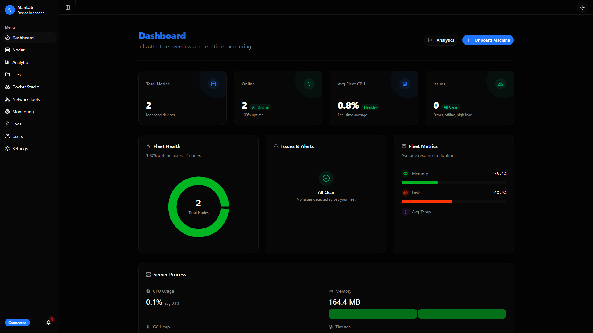
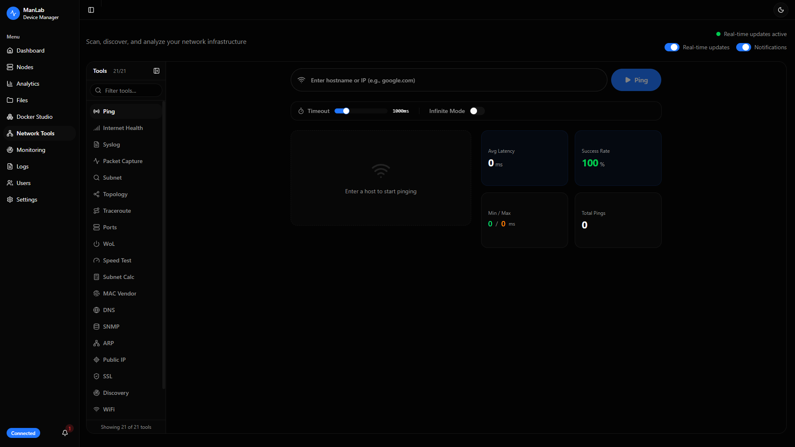
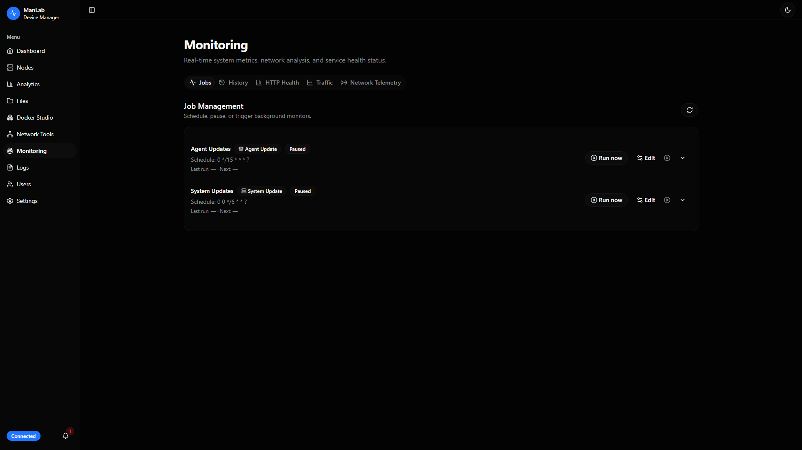
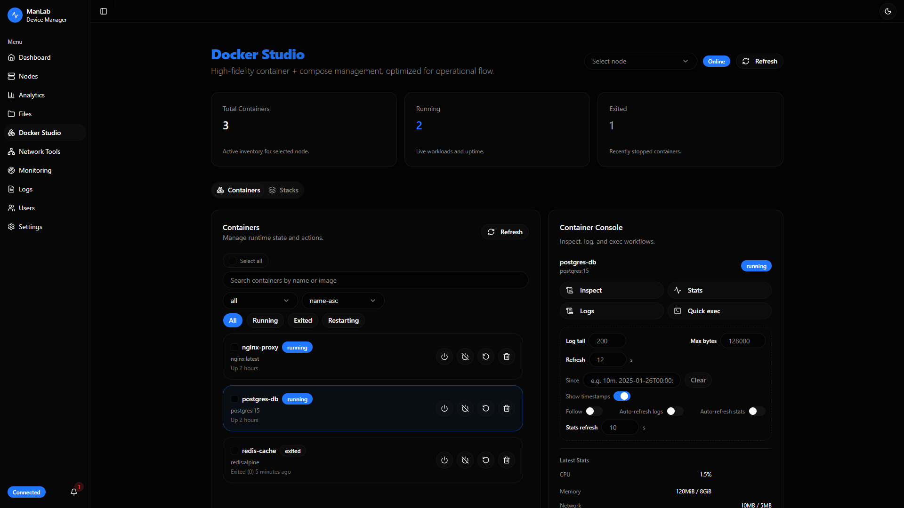
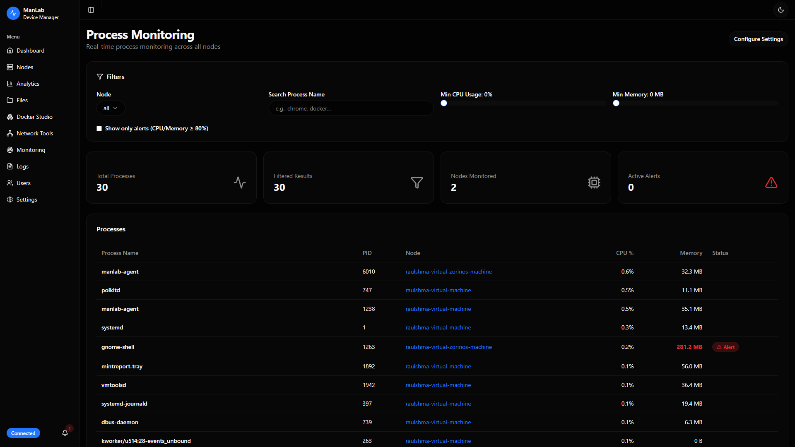
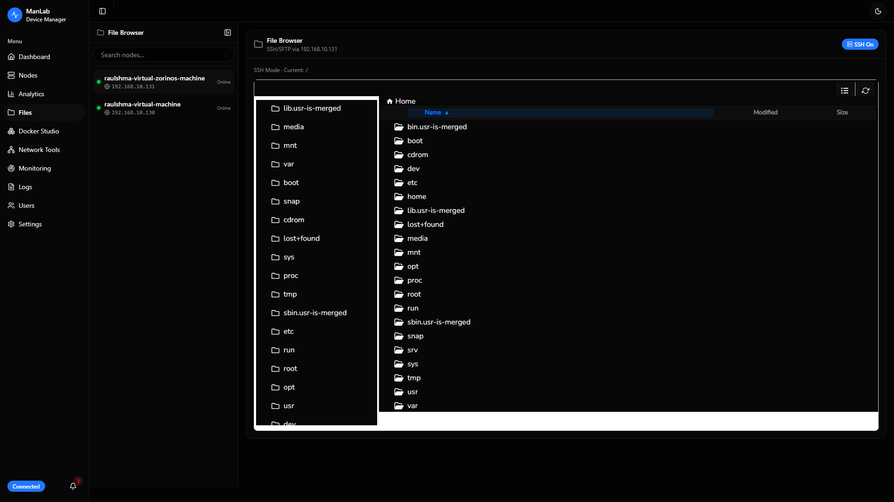
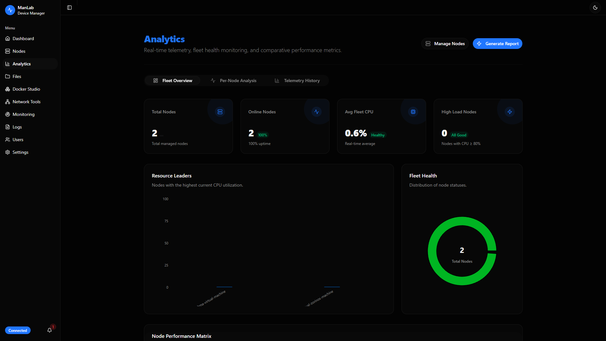
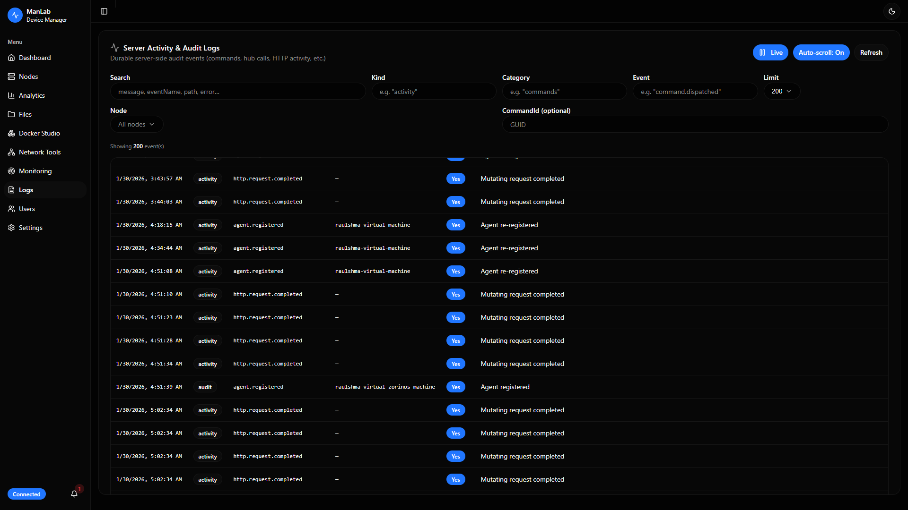
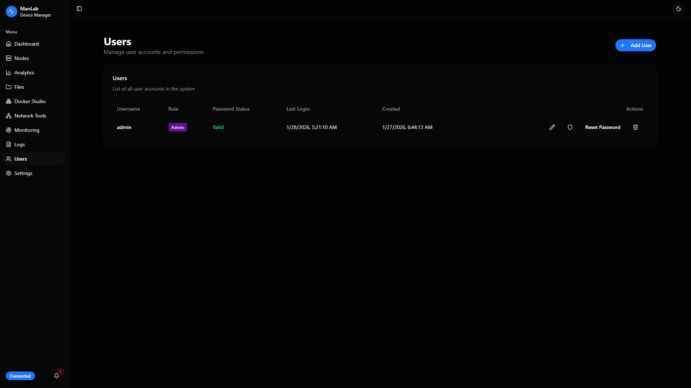

# ManLab (.NET 10)

ManLab is a hub-and-spoke home-lab / fleet management system:

- **Server (hub)**: `src/ManLab.Server` — ASP.NET Core Web API + SignalR + EF Core (Postgres)
- **Web dashboard**: `src/ManLab.Web` — Vite + React + TypeScript
- **Agent (spoke)**: `src/ManLab.Agent` — .NET console app intended for Native AOT (`PublishAot=true`)

The agent maintains a reverse connection to the server (SignalR) and periodically sends telemetry/heartbeats.

## Key Features

### Dashboard
Overview of the system, showing connected nodes and their status.



### Network Scanner
Discover devices on the network.



### Monitoring
Real-time resource usage monitoring.



### Node Management
Manage connected agents and their configurations.


### Docker Studio
Manage Docker containers and images.



### Process Manager
Monitor and manage system processes.



### File Browser
Browse and manage files on connected nodes.



### Analytics
View historical data and trends.



### Audit Logs
Track system events and user actions.



### User Management
Manage users and permissions.



## Repo layout

- `src/ManLab.Server`: REST API (`/api/*`) + SignalR hub (`/hubs/agent`) + DB migrations
- `src/ManLab.Web`: dashboard UI (dev server proxies `/api` and `/hubs`)
- `src/ManLab.Agent`: agent app + command handlers
- `src/ManLab.AppHost`: .NET Aspire local orchestration (recommended)
- `src/ManLab.Build`: publishes/stages agent binaries for download from the server
- `scripts/`: convenience scripts (install + publish helpers)

## Local development (recommended): .NET Aspire

The Aspire AppHost orchestrates:

- PostgreSQL (container)
- `ManLab.Server`
- `ManLab.Web` (Vite dev server)

### Prereqs

- .NET SDK 10.x
- Docker Desktop (for the Postgres container)
- Node.js (for the Vite dev server)
- (Optional) Aspire CLI

### Run

- **Option 1 (VS Code / CLI)**: Run `dotnet run --project src/ManLab.AppHost`
- **Option 2 (Aspire CLI)**: Run `aspire run` from the repo root

Open the Aspire dashboard URL shown in the terminal to view logs/traces/metrics and the allocated endpoints.

## Docker deployment

You can deploy the full stack (Postgres + Server + Web) using Docker Compose.

### Option A: Use pre-built GitHub images (Fastest)

Create a `docker-compose.yml` file:

```yaml
services:
  postgres:
    image: "docker.io/timescale/timescaledb:latest-pg17"
    restart: unless-stopped
    environment:
      POSTGRES_HOST_AUTH_METHOD: "scram-sha-256"
      POSTGRES_INITDB_ARGS: "--locale=C --encoding=UTF8"
      POSTGRES_USER: "postgres"
      POSTGRES_PASSWORD: "${PGPASSWORD:-changeme}"
      LANG: "C.UTF-8"
      LC_ALL: "C.UTF-8"
    expose:
      - "5432"
    volumes:
      - type: "volume"
        target: "/var/lib/postgresql/data"
        source: "manlab-db-data"
        read_only: false
    networks:
      - "manlab-network"
  server:
    image: "${SERVER_IMAGE:-ghcr.io/raulshma/manlab-server:latest}"
    restart: unless-stopped
    environment:
      OTEL_DOTNET_EXPERIMENTAL_OTLP_EMIT_EXCEPTION_LOG_ATTRIBUTES: "true"
      OTEL_DOTNET_EXPERIMENTAL_OTLP_EMIT_EVENT_LOG_ATTRIBUTES: "true"
      OTEL_DOTNET_EXPERIMENTAL_OTLP_RETRY: "in_memory"
      ASPNETCORE_FORWARDEDHEADERS_ENABLED: "true"
      HTTP_PORTS: "8080"
      ConnectionStrings__manlab: "Host=postgres;Port=5432;Username=postgres;Password=${PGPASSWORD:-changeme};Database=manlab"
      MANLAB_HOST: "postgres"
      MANLAB_PORT: "5432"
      MANLAB_USERNAME: "postgres"
      MANLAB_PASSWORD: "${PGPASSWORD:-changeme}"
      MANLAB_URI: "postgresql://postgres:${PGPASSWORD:-changeme}@postgres:5432/manlab"
      MANLAB_JDBCCONNECTIONSTRING: "jdbc:postgresql://postgres:5432/manlab"
      MANLAB_DATABASENAME: "manlab"
    ports:
      - "5247:8080"
    expose:
      - "8080"
      - "${SERVER_PORT:-8081}"
    depends_on:
      postgres:
        condition: "service_started"
    networks:
      - "manlab-network"
  manlab-web:
    restart: unless-stopped
    image: "${WEB_IMAGE:-ghcr.io/raulshma/manlab-web:latest}"
    environment:
      SERVER_HTTP: "http://server:8080"
      services__server__http__0: "http://server:8080"
      SERVER_HTTPS: "https://server:${SERVER_PORT:-8081}"
      SERVER_HTTP_EXTERNAL: "tcp://server:8080"
      services__server__http-external__0: "tcp://server:8080"
    ports:
      - "8080:80"
    depends_on:
      server:
        condition: "service_started"
    networks:
      - "manlab-network"
networks:
  manlab-network:
    driver: "bridge"
volumes:
  manlab-db-data:
    driver: "local"
```

Run it:

```bash
# Linux/macOS
PGPASSWORD=your_secret_password docker compose up -d

# Windows PowerShell
$env:PGPASSWORD="your_secret_password"; docker compose up -d
```

> **Note**: If `latest` tag is not available, check [ManLab Packages](https://github.com/raulshma?tab=packages&repo_name=manlab) for the latest version tag.

### Agent onboarding note

When installing agents, use the **dashboard origin** as the server base URL (e.g. `http://<host>:5247`), not the internal server container port.

---

### Option B: Build from source (Aspire)

For a custom containerized deployment, this repo uses Aspire’s Docker hosting integration.

The source of truth is the Aspire app model in `src/ManLab.AppHost/AppHost.cs`.

#### 1) Publish a Docker Compose bundle

- Run `aspire publish -o aspire-output` from the repo root.

This generates:

- `aspire-output/docker-compose.yaml`
- `aspire-output/.env`

#### 2) Set required environment variables

Copy the example file and fill in values:

- Copy `aspire-output/.env.example` → `aspire-output/.env`
- Set at least:
	- `PGPASSWORD`
	- `SERVER_IMAGE`
	- `WEB_IMAGE`
	- `SERVER_PORT` (used for HTTPS endpoint metadata; set to `8081` if unsure)

Tip: if you’re deploying using images already pushed to GHCR (for example from the `Build Container` GitHub Action), you can generate a bundle and stamp the image tags in one go:

- Windows: `scripts/publish-compose-bundle.ps1 -ServerImage <ghcr-image> -WebImage <ghcr-image>`
- Linux/macOS: `scripts/publish-compose-bundle.sh --server-image <ghcr-image> --web-image <ghcr-image>`

#### 3) Build/pull images

- Server image is built from `src/ManLab.Server/Dockerfile` (or pulled from your registry).
- Web image is built from `src/ManLab.Web/Dockerfile` (nginx serves the SPA and reverse-proxies `/api` and `/hubs`).

#### 4) Run with Docker Compose

- Run `docker compose -f aspire-output/docker-compose.yaml --env-file aspire-output/.env up -d`

Then open:

- Dashboard: `http://localhost:8080`

## Manual local run (no Aspire)

If you prefer running pieces yourself:

1) Start PostgreSQL (container or local install)
2) Run the server (`src/ManLab.Server`)
	- Dev default URL: `http://localhost:5247`
	- API reference (dev): `http://localhost:5247/scalar`
	- On startup the server applies EF Core migrations (`Database.MigrateAsync()`)
3) Run the web app (`src/ManLab.Web`)
	- Vite dev server proxies `/api` and `/hubs` to the backend.
	- Proxy target selection order is documented inline in `src/ManLab.Web/vite.config.ts` and falls back to `http://localhost:5247`.
4) Run an agent (`src/ManLab.Agent`) pointed at the hub URL

## Agent configuration

The SignalR hub endpoint is:

- `http(s)://<server-host>/hubs/agent`

You can configure the agent via `src/ManLab.Agent/appsettings.json` or environment variables:

- `MANLAB_SERVER_URL` (must include `/hubs/agent`)
- `MANLAB_AUTH_TOKEN` (optional)

Additional `MANLAB_*` environment variables map to the `Agent` section (telemetry toggles, rate limits, remote tools, etc.). See `src/ManLab.Agent/appsettings.json` for the full set of supported keys.

Default dev config is:

- `ServerUrl`: `http://localhost:5247/hubs/agent`

## Publishing + staging agent binaries (server download API)

The server exposes a small “binary distribution” API used by the installer scripts:

- `GET /api/binaries/agent` (lists available RIDs)
- `GET /api/binaries/agent/release-catalog` (lists locally staged versions + optional GitHub tags)
- `GET /api/binaries/agent/manifest` (describes staged binaries + hashes)
- `GET /api/binaries/agent/{rid}` (downloads `manlab-agent` / `manlab-agent.exe`)
- `GET /api/binaries/agent/{rid}/appsettings.json` (serves a staged or generated template)
- `GET /api/binaries/agent/github-release-info` (GitHub release download URLs)

Binaries are served from the server’s distribution root:

- Default: `src/ManLab.Server/Distribution/agent/{channel}/{rid}/...`
- Versioned layout: `src/ManLab.Server/Distribution/agent/{channel}/{version}/{rid}/...`
- Legacy fallback (if enabled): `src/ManLab.Server/Distribution/agent/{rid}/...`
- Configurable via `BinaryDistribution:RootPath` (defaults to `{ContentRoot}/Distribution`, default channel is `stable`)

To publish and stage binaries for common RIDs, use the build tool (or the wrapper script):

- `src/ManLab.Build` (authoritative implementation)
- `scripts/publish-agent.ps1` (convenience wrapper that invokes `ManLab.Build`)

## Installing the agent on machines

See `INSTALLATION.md` for the installer scripts:

- Linux: `scripts/install.sh` (systemd)
- Windows: `scripts/install.ps1` (Task Scheduler)

## Notes / gotchas

- **Aspire connection name**: the AppHost uses a Postgres database resource name of `manlab`; the server uses the same connection name via `builder.AddNpgsqlDbContext<DataContext>("manlab")`.
- **Generated deployment output**: `aspire-output/` is generated by `aspire publish` (Compose + `.env`). Treat it as build output; don’t commit it, except for the provided `aspire-output/.env.example`.
